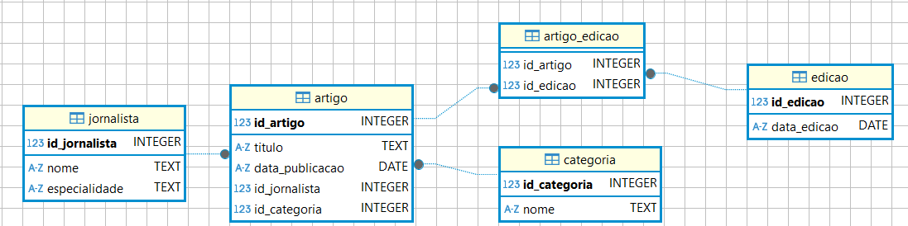

# Ficha de Trabalho


Passo 0: preparação do sistema para correr em Jupyter Notebook


```python
%pip install jupysql --upgrade --quiet
```

    Note: you may need to restart the kernel to use updated packages.
    


```python
# Load the jupysql extension
# This allows us to use SQL magic commands in Jupyter notebooks
%load_ext sql
```


```python
# Connect to the SQLite database
%sql sqlite:///ficha_de_trabalho_01.sqlite
```


<span style="None">Connecting to &#x27;sqlite:///ficha_de_trabalho_01.sqlite&#x27;</span>


```python
# Set the display limit for SQL queries
# This controls how many rows are displayed in the output of SQL queries
%config SqlMagic.displaylimit = 0

# Enable foreign key constraints in SQLite
# This ensures that foreign key relationships are enforced in the database
%sql PRAGMA foreign_keys = ON
```


<span style="None">Running query in &#x27;sqlite:///ficha_de_trabalho_01.sqlite&#x27;</span>


<table>
    <thead>
        <tr>
        </tr>
    </thead>
    <tbody>
    </tbody>
</table>


```python
# Display the list of tables in the database
# This command lists all the tables in the connected SQLite database
%sqlcmd tables
```


<table>
    <thead>
        <tr>
            <th>Name</th>
        </tr>
    </thead>
    <tbody>
        <tr>
            <td>artigo</td>
        </tr>
        <tr>
            <td>artigo_edicao</td>
        </tr>
        <tr>
            <td>categoria</td>
        </tr>
        <tr>
            <td>edicao</td>
        </tr>
        <tr>
            <td>jornalista</td>
        </tr>
    </tbody>
</table>


----



# 📌 Parte 1: Criação das Tabelas


```sql
%%sql
-- Eliminar todas as tabelas se já existirem
DROP TABLE IF EXISTS artigo_edicao;
DROP TABLE IF EXISTS edicao;
DROP TABLE IF EXISTS artigo;
DROP TABLE IF EXISTS categoria;
DROP TABLE IF EXISTS jornalista;
```


<span style="None">Running query in &#x27;sqlite:///ficha_de_trabalho_01.sqlite&#x27;</span>


<table>
    <thead>
        <tr>
        </tr>
    </thead>
    <tbody>
    </tbody>
</table>


---

## Tabela 1: `jornalista`
   - `id_jornalista` (INT, PK)
   - `nome` (TEXT)
   - `especialidade` (TEXT)


```sql
%%sql
-- Tabela: jornalista
DROP TABLE IF EXISTS jornalista;

CREATE TABLE IF NOT EXISTS jornalista (
    id_jornalista INTEGER PRIMARY KEY AUTOINCREMENT, -- chave primária, auto-incremento
    nome TEXT NOT NULL,                              -- nome do jornalista
    especialidade TEXT NOT NULL                      -- especialidade do jornalista (pode ser Política, Cultura, Desporto, etc.)
);
```


<span style="None">Running query in &#x27;sqlite:///ficha_de_trabalho_01.sqlite&#x27;</span>


<table>
    <thead>
        <tr>
        </tr>
    </thead>
    <tbody>
    </tbody>
</table>


* `DROP TABLE IF EXISTS jornalista;`: Garante que qualquer tabela com o mesmo nome seja eliminada antes da criação — útil durante testes ou desenvolvimento.
* `CREATE TABLE IF NOT EXISTS`: Evita erro caso a tabela já exista.
* `id_jornalista INTEGER PRIMARY KEY`: Define a chave primária como um inteiro, o que está de acordo com o enunciado.
* `nome TEXT NOT NULL` e `especialidade TEXT NOT NULL`: As colunas estão corretamente tipadas e não permitem valores nulos, o que é geralmente desejável neste contexto.

**Observação**:
* O tipo `INTEGER PRIMARY KEY` no SQLite gera automaticamente valores únicos e sequenciais se não forem especificados ao inserir dados (é um alias para AUTOINCREMENT implícito).
* No MySQL, para comportamento semelhante, seria necessário usar `AUTO_INCREMENT`.

Apesar de não ser obrigatório em SQLite, considero que é sempre melhor deixar a instrução explicita do que implícita.

### Inserção de dados na tabela `jornalista`


```sql
%%sql
-- Inserção de dados na tabela `jornalista`
INSERT INTO jornalista (nome, especialidade) VALUES
    ('José Rodrigues dos Santos', 'Política'),
    ('Clara Ferreira Alves', 'Cultura'),
    ('Rui Pedro Braz', 'Desporto'),
    ('Ana Lourenço', 'Política'),
    ('Ricardo Costa', 'Economia'),
    ('Fátima Campos Ferreira', 'Sociedade'),
    ('Paulo Dentinho', 'Internacional'),
    ('Margarida Marante', 'Entrevistas'),
    ('Carlos Daniel', 'Desporto'),
    ('Dina Aguiar', 'Cultura')
;
```


<span style="None">Running query in &#x27;sqlite:///ficha_de_trabalho_01.sqlite&#x27;</span>


<span style="color: green">10 rows affected.</span>


<table>
    <thead>
        <tr>
        </tr>
    </thead>
    <tbody>
    </tbody>
</table>


```sql
%%sql
-- Verificação da inserção
SELECT COUNT(*) AS "Número de jornalistas" FROM jornalista;
```


<span style="None">Running query in &#x27;sqlite:///ficha_de_trabalho_01.sqlite&#x27;</span>


<table>
    <thead>
        <tr>
            <th>Número de jornalistas</th>
        </tr>
    </thead>
    <tbody>
        <tr>
            <td>10</td>
        </tr>
    </tbody>
</table>


```sql
%%sql
SELECT * FROM jornalista;
```


<span style="None">Running query in &#x27;sqlite:///ficha_de_trabalho_01.sqlite&#x27;</span>


<table>
    <thead>
        <tr>
            <th>id_jornalista</th>
            <th>nome</th>
            <th>especialidade</th>
        </tr>
    </thead>
    <tbody>
        <tr>
            <td>1</td>
            <td>José Rodrigues dos Santos</td>
            <td>Política</td>
        </tr>
        <tr>
            <td>2</td>
            <td>Clara Ferreira Alves</td>
            <td>Cultura</td>
        </tr>
        <tr>
            <td>3</td>
            <td>Rui Pedro Braz</td>
            <td>Desporto</td>
        </tr>
        <tr>
            <td>4</td>
            <td>Ana Lourenço</td>
            <td>Política</td>
        </tr>
        <tr>
            <td>5</td>
            <td>Ricardo Costa</td>
            <td>Economia</td>
        </tr>
        <tr>
            <td>6</td>
            <td>Fátima Campos Ferreira</td>
            <td>Sociedade</td>
        </tr>
        <tr>
            <td>7</td>
            <td>Paulo Dentinho</td>
            <td>Internacional</td>
        </tr>
        <tr>
            <td>8</td>
            <td>Margarida Marante</td>
            <td>Entrevistas</td>
        </tr>
        <tr>
            <td>9</td>
            <td>Carlos Daniel</td>
            <td>Desporto</td>
        </tr>
        <tr>
            <td>10</td>
            <td>Dina Aguiar</td>
            <td>Cultura</td>
        </tr>
    </tbody>
</table>


---

## Tabela 2: `categoria`(s)
   - `id_categoria` (INT, PK)
   - `nome` (TEXT) — ex: Política, Cultura, Desporto


```sql
%%sql
-- Tabela `categoria`
DROP TABLE IF EXISTS categoria;

CREATE TABLE IF NOT EXISTS categoria (
    id_categoria INTEGER PRIMARY KEY AUTOINCREMENT,   -- chave primária, auto-incremento
    nome TEXT NOT NULL UNIQUE                         -- garantia de que não há categorias repetidas (ex: Política, Cultura, Desporto, etc.)
);
```


<span style="None">Running query in &#x27;sqlite:///ficha_de_trabalho_01.sqlite&#x27;</span>


<table>
    <thead>
        <tr>
        </tr>
    </thead>
    <tbody>
    </tbody>
</table>


### Inserção de dados na tabela `categoria`(s)


```sql
%%sql
-- Inserção de dados na tabela `categoria`
INSERT INTO categoria (nome) VALUES
    ('Política'),
    ('Cultura'),
    ('Desporto'),
    ('Economia'),
    ('Sociedade'),
    ('Internacional'),
    ('Tecnologia'),
    ('Saúde'),
    ('Ambiente'),
    ('Educação')
;
```


<span style="None">Running query in &#x27;sqlite:///ficha_de_trabalho_01.sqlite&#x27;</span>


<span style="color: green">10 rows affected.</span>


<table>
    <thead>
        <tr>
        </tr>
    </thead>
    <tbody>
    </tbody>
</table>


---

## Tabela 3: `artigo`(s)
   - `id_artigo` (INT, PK)
   - `titulo` (TEXT)
   - `data_publicacao` (DATE)
   - `id_jornalista` (INT, FK → jornalista.id_jornalista)
   - `id_categoria` (INT, FK → categoria.id_categoria)


```sql
%%sql
-- Tabela `artigo`
DROP TABLE IF EXISTS artigo;

CREATE TABLE IF NOT EXISTS artigo (
    id_artigo         INTEGER PRIMARY KEY AUTOINCREMENT,            -- chave primária, auto-incremento
    titulo            TEXT NOT NULL,                                -- título do artigo
    data_publicacao   DATE NOT NULL DEFAULT CURRENT_DATE,           -- data de publicação do artigo
    id_jornalista     INTEGER NOT NULL,                             -- chave estrangeira referenciando o jornalista
    id_categoria      INTEGER NOT NULL,                             -- chave estrangeira referenciando a categoria
    FOREIGN KEY (id_jornalista) REFERENCES jornalista(id_jornalista),
    FOREIGN KEY (id_categoria) REFERENCES categoria(id_categoria)
);
```


<span style="None">Running query in &#x27;sqlite:///ficha_de_trabalho_01.sqlite&#x27;</span>


<table>
    <thead>
        <tr>
        </tr>
    </thead>
    <tbody>
    </tbody>
</table>


### Inserção de dados na tabela `artigo`(s)


```sql
%%sql
INSERT INTO artigo (titulo, data_publicacao, id_jornalista, id_categoria) VALUES
    ('Orçamento de Estado aprovado na generalidade',         '2025-07-01', 1, 1),  -- Política
    ('Festival de Teatro de Almada arranca com casa cheia',  '2025-07-01', 2, 2),  -- Cultura
    ('FC Porto contrata avançado brasileiro',                '2025-07-02', 3, 3),  -- Desporto
    ('Eleições Europeias: o que está em jogo para Portugal', '2025-07-02', 4, 1), -- Política
    ('Inflação abranda para 1,8 % em maio',                  '2025-07-03', 5, 4),  -- Economia
    ('Programas sociais reforçam apoio a famílias',          '2025-07-03', 6, 5),  -- Sociedade
    ('Cimeira da NATO discute novo modelo de defesa',        '2025-07-04', 7, 6),  -- Internacional
    ('Start-ups portuguesas batem recorde de investimento',  '2025-07-04', 1, 7),  -- Tecnologia
    ('SNS recebe injecção adicional de 500 M€',              '2025-07-05', 5, 8),  -- Saúde
    ('Seca extrema afecta 30 % do território nacional',      '2025-07-05', 2, 9)   -- Ambiente
;  
```


<span style="None">Running query in &#x27;sqlite:///ficha_de_trabalho_01.sqlite&#x27;</span>


<span style="color: green">10 rows affected.</span>


<table>
    <thead>
        <tr>
        </tr>
    </thead>
    <tbody>
    </tbody>
</table>


### Dados extra: mais artigos


```sql
%%sql
-- dados extra para a tabela `artigo` para a categoria Política
INSERT INTO artigo (titulo, data_publicacao, id_jornalista, id_categoria) VALUES
    ('Debate parlamentar aquece sobre habitação',          '2025-05-30', 1, 1),
    ('Reformas constitucionais em cima da mesa',           '2025-05-31', 4, 1),
    ('Presidente da República discursa sobre coesão',      '2025-06-01', 6, 1);
```


<span style="None">Running query in &#x27;sqlite:///ficha_de_trabalho_01.sqlite&#x27;</span>


<span style="color: green">3 rows affected.</span>


<table>
    <thead>
        <tr>
        </tr>
    </thead>
    <tbody>
    </tbody>
</table>


```sql
%%sql
-- dados extra da categorua Cultura
INSERT INTO artigo (titulo, data_publicacao, id_jornalista, id_categoria) VALUES
    ('Bienal de Veneza: artistas portugueses em destaque', '2025-06-01', 2, 2),   -- Clara Ferreira Alves
    ('Festa do Livro do Porto apresenta programação',      '2025-06-01', 10, 2),  -- Dina Aguiar
    ('Exposição retrospetiva de Paula Rego inaugurada',    '2025-06-01', 2, 2);   -- Clara Ferreira Alves
```


<span style="None">Running query in &#x27;sqlite:///ficha_de_trabalho_01.sqlite&#x27;</span>


<span style="color: green">3 rows affected.</span>


<table>
    <thead>
        <tr>
        </tr>
    </thead>
    <tbody>
    </tbody>
</table>


```sql
%%sql
-- dados extra da categoria Desporto 
INSERT INTO artigo (titulo, data_publicacao, id_jornalista, id_categoria) VALUES
    -- 4 de julho
    ('Fluminense vence Al-Hilal e homenageia Diogo Jota com minuto de silêncio',      '2025-07-04', 3, 3),
    ('Adepto português no Euro Feminino presta tributo a Diogo Jota em Berna',        '2025-07-04', 3, 3),
    ('Treinos do Mundial de Clubes arrancam com homenagem a Diogo Jota',              '2025-07-04', 9, 3),

    -- 5 de julho
    ('Rúben Neves carrega o caixão no funeral emotivo de Diogo Jota',                 '2025-07-05', 3, 3),
    ('Funeral de Diogo Jota reúne companheiros e dirigentes do futebol mundial',      '2025-07-05', 9, 3),

    -- 6 de julho
    ('Milhares despedem-se de Diogo Jota e André Silva no Porto',                     '2025-07-06', 3, 3),
    ('Hamilton confia em pódio em Silverstone após qualificação com a Ferrari',       '2025-07-06', 9, 3);
```


<span style="None">Running query in &#x27;sqlite:///ficha_de_trabalho_01.sqlite&#x27;</span>


<span style="color: green">7 rows affected.</span>


<table>
    <thead>
        <tr>
        </tr>
    </thead>
    <tbody>
    </tbody>
</table>


```sql
%%sql
-- verificação da inserção
SELECT COUNT(*) AS "Número de artigos" FROM artigo;
```


<span style="None">Running query in &#x27;sqlite:///ficha_de_trabalho_01.sqlite&#x27;</span>


<table>
    <thead>
        <tr>
            <th>Número de artigos</th>
        </tr>
    </thead>
    <tbody>
        <tr>
            <td>23</td>
        </tr>
    </tbody>
</table>


```sql
%%sql
SELECT data_publicacao AS "Data", COUNT(*) AS "Total de artigos"
    FROM artigo
    GROUP BY data_publicacao
    ORDER BY "Total de artigos" DESC, data_publicacao
    LIMIT 4;
```


<span style="None">Running query in &#x27;sqlite:///ficha_de_trabalho_01.sqlite&#x27;</span>


<table>
    <thead>
        <tr>
            <th>Data</th>
            <th>Total de artigos</th>
        </tr>
    </thead>
    <tbody>
        <tr>
            <td>2025-07-04</td>
            <td>5</td>
        </tr>
        <tr>
            <td>2025-06-01</td>
            <td>4</td>
        </tr>
        <tr>
            <td>2025-07-05</td>
            <td>4</td>
        </tr>
        <tr>
            <td>2025-07-01</td>
            <td>2</td>
        </tr>
    </tbody>
</table>


---

## Tabela 4: `edicao`(ões)
   - `id_edicao` (INT, PK)
   - `data_edicao` (DATE)


```sql
%%sql
-- Eliminar a tabela se já existir
DROP TABLE IF EXISTS edicao;

-- Criar a tabela edicao
CREATE TABLE IF NOT EXISTS edicao (
    id_edicao   INTEGER PRIMARY KEY AUTOINCREMENT,       -- chave primária, auto-incremento
    data_edicao DATE NOT NULL DEFAULT CURRENT_DATE       -- data de publicação do artigo
);
```


<span style="None">Running query in &#x27;sqlite:///ficha_de_trabalho_01.sqlite&#x27;</span>


<table>
    <thead>
        <tr>
        </tr>
    </thead>
    <tbody>
    </tbody>
</table>


### Inserção de dados na tabela `edicao`(s)


A considerar que as edições são semanais e saiem aos domingos.


```sql
%%sql
-- Inserir dados na tabela `edicao`
INSERT INTO edicao (data_edicao) VALUES
    ('2025-05-25'),   -- Ediações semanais só aos domingos
    ('2025-06-01'),
    ('2025-06-08'),
    ('2025-06-15'),
    ('2025-06-22'),
    ('2025-06-29'),
    ('2025-07-06'),
    ('2025-07-13'),
    ('2025-07-20'),
    ('2025-07-27'),
    ('2025-08-03'),
    ('2025-08-10'),
    ('2025-08-17'),
    ('2025-08-24'),
    ('2025-08-31');

```


<span style="None">Running query in &#x27;sqlite:///ficha_de_trabalho_01.sqlite&#x27;</span>


<span style="color: green">15 rows affected.</span>


<table>
    <thead>
        <tr>
        </tr>
    </thead>
    <tbody>
    </tbody>
</table>


---

## Tabela 5. `artigo_edicao`
   - `id_artigo` (INT, FK → artigo.id_artigo)
   - `id_edicao` (INT, FK → edicao.id_edicao)


```sql
%%sql
-- Tabela `artigo_edicao`
DROP TABLE IF EXISTS artigo_edicao;

CREATE TABLE IF NOT EXISTS artigo_edicao (
    id_artigo   INTEGER NOT NULL,                             -- chave estrangeira referenciando o artigo
    id_edicao   INTEGER NOT NULL,                             -- chave estrangeira referenciando a edição
    FOREIGN KEY (id_artigo) REFERENCES artigo(id_artigo),
    FOREIGN KEY (id_edicao) REFERENCES edicao(id_edicao)
);
```


<span style="None">Running query in &#x27;sqlite:///ficha_de_trabalho_01.sqlite&#x27;</span>


<table>
    <thead>
        <tr>
        </tr>
    </thead>
    <tbody>
    </tbody>
</table>


### Inserção de dados na tabela `artigo_edicao`(ões)

Considerando que:
* Os artigos estão criados e já têm data.
* As edições estão criadas e têm data e são semanais (aos domingos). 

Então, considerar todos os artigos da semana anterior para a `edicao` do domingo seguinte.
Por exemplo, para a edição de `2025-07-06` entrão todos os artigos de `2025-07-05` (-1 dia) a `2025-06-29` (-7 dias).


```sql
%%sql
-- Consulta prévia antes da inserir os dados na tabela `artigo_edicao`
SELECT
    e.id_edicao       AS "ID da Edição",
    a.id_artigo       AS "ID do Artigo",
    e.data_edicao     AS "Data da Edição",
    a.titulo          AS "Título do Artigo",
    j.nome            AS "Jornalista",
    a.data_publicacao AS "Data de Publicação"
FROM edicao           AS e
JOIN artigo           AS a
    ON a.data_publicacao
        BETWEEN DATE(e.data_edicao, '-7 days')  -- 7 dias antes (inclusive)
            AND DATE(e.data_edicao, '-1 day')   -- 1 dia antes (inclusive)
JOIN jornalista j     ON  a.id_jornalista = j.id_jornalista
JOIN categoria  c     ON   a.id_categoria = c.id_categoria
ORDER BY e.data_edicao, a.data_publicacao;
```


<span style="None">Running query in &#x27;sqlite:///ficha_de_trabalho_01.sqlite&#x27;</span>


<table>
    <thead>
        <tr>
            <th>ID da Edição</th>
            <th>ID do Artigo</th>
            <th>Data da Edição</th>
            <th>Título do Artigo</th>
            <th>Jornalista</th>
            <th>Data de Publicação</th>
        </tr>
    </thead>
    <tbody>
        <tr>
            <td>2</td>
            <td>11</td>
            <td>2025-06-01</td>
            <td>Debate parlamentar aquece sobre habitação</td>
            <td>José Rodrigues dos Santos</td>
            <td>2025-05-30</td>
        </tr>
        <tr>
            <td>2</td>
            <td>12</td>
            <td>2025-06-01</td>
            <td>Reformas constitucionais em cima da mesa</td>
            <td>Ana Lourenço</td>
            <td>2025-05-31</td>
        </tr>
        <tr>
            <td>3</td>
            <td>13</td>
            <td>2025-06-08</td>
            <td>Presidente da República discursa sobre coesão</td>
            <td>Fátima Campos Ferreira</td>
            <td>2025-06-01</td>
        </tr>
        <tr>
            <td>3</td>
            <td>14</td>
            <td>2025-06-08</td>
            <td>Bienal de Veneza: artistas portugueses em destaque</td>
            <td>Clara Ferreira Alves</td>
            <td>2025-06-01</td>
        </tr>
        <tr>
            <td>3</td>
            <td>15</td>
            <td>2025-06-08</td>
            <td>Festa do Livro do Porto apresenta programação</td>
            <td>Dina Aguiar</td>
            <td>2025-06-01</td>
        </tr>
        <tr>
            <td>3</td>
            <td>16</td>
            <td>2025-06-08</td>
            <td>Exposição retrospetiva de Paula Rego inaugurada</td>
            <td>Clara Ferreira Alves</td>
            <td>2025-06-01</td>
        </tr>
        <tr>
            <td>7</td>
            <td>1</td>
            <td>2025-07-06</td>
            <td>Orçamento de Estado aprovado na generalidade</td>
            <td>José Rodrigues dos Santos</td>
            <td>2025-07-01</td>
        </tr>
        <tr>
            <td>7</td>
            <td>2</td>
            <td>2025-07-06</td>
            <td>Festival de Teatro de Almada arranca com casa cheia</td>
            <td>Clara Ferreira Alves</td>
            <td>2025-07-01</td>
        </tr>
        <tr>
            <td>7</td>
            <td>3</td>
            <td>2025-07-06</td>
            <td>FC Porto contrata avançado brasileiro</td>
            <td>Rui Pedro Braz</td>
            <td>2025-07-02</td>
        </tr>
        <tr>
            <td>7</td>
            <td>4</td>
            <td>2025-07-06</td>
            <td>Eleições Europeias: o que está em jogo para Portugal</td>
            <td>Ana Lourenço</td>
            <td>2025-07-02</td>
        </tr>
        <tr>
            <td>7</td>
            <td>5</td>
            <td>2025-07-06</td>
            <td>Inflação abranda para 1,8 % em maio</td>
            <td>Ricardo Costa</td>
            <td>2025-07-03</td>
        </tr>
        <tr>
            <td>7</td>
            <td>6</td>
            <td>2025-07-06</td>
            <td>Programas sociais reforçam apoio a famílias</td>
            <td>Fátima Campos Ferreira</td>
            <td>2025-07-03</td>
        </tr>
        <tr>
            <td>7</td>
            <td>7</td>
            <td>2025-07-06</td>
            <td>Cimeira da NATO discute novo modelo de defesa</td>
            <td>Paulo Dentinho</td>
            <td>2025-07-04</td>
        </tr>
        <tr>
            <td>7</td>
            <td>8</td>
            <td>2025-07-06</td>
            <td>Start-ups portuguesas batem recorde de investimento</td>
            <td>José Rodrigues dos Santos</td>
            <td>2025-07-04</td>
        </tr>
        <tr>
            <td>7</td>
            <td>17</td>
            <td>2025-07-06</td>
            <td>Fluminense vence Al-Hilal e homenageia Diogo Jota com minuto de silêncio</td>
            <td>Rui Pedro Braz</td>
            <td>2025-07-04</td>
        </tr>
        <tr>
            <td>7</td>
            <td>18</td>
            <td>2025-07-06</td>
            <td>Adepto português no Euro Feminino presta tributo a Diogo Jota em Berna</td>
            <td>Rui Pedro Braz</td>
            <td>2025-07-04</td>
        </tr>
        <tr>
            <td>7</td>
            <td>19</td>
            <td>2025-07-06</td>
            <td>Treinos do Mundial de Clubes arrancam com homenagem a Diogo Jota</td>
            <td>Carlos Daniel</td>
            <td>2025-07-04</td>
        </tr>
        <tr>
            <td>7</td>
            <td>9</td>
            <td>2025-07-06</td>
            <td>SNS recebe injecção adicional de 500 M€</td>
            <td>Ricardo Costa</td>
            <td>2025-07-05</td>
        </tr>
        <tr>
            <td>7</td>
            <td>10</td>
            <td>2025-07-06</td>
            <td>Seca extrema afecta 30 % do território nacional</td>
            <td>Clara Ferreira Alves</td>
            <td>2025-07-05</td>
        </tr>
        <tr>
            <td>7</td>
            <td>20</td>
            <td>2025-07-06</td>
            <td>Rúben Neves carrega o caixão no funeral emotivo de Diogo Jota</td>
            <td>Rui Pedro Braz</td>
            <td>2025-07-05</td>
        </tr>
        <tr>
            <td>7</td>
            <td>21</td>
            <td>2025-07-06</td>
            <td>Funeral de Diogo Jota reúne companheiros e dirigentes do futebol mundial</td>
            <td>Carlos Daniel</td>
            <td>2025-07-05</td>
        </tr>
        <tr>
            <td>8</td>
            <td>22</td>
            <td>2025-07-13</td>
            <td>Milhares despedem-se de Diogo Jota e André Silva no Porto</td>
            <td>Rui Pedro Braz</td>
            <td>2025-07-06</td>
        </tr>
        <tr>
            <td>8</td>
            <td>23</td>
            <td>2025-07-13</td>
            <td>Hamilton confia em pódio em Silverstone após qualificação com a Ferrari</td>
            <td>Carlos Daniel</td>
            <td>2025-07-06</td>
        </tr>
    </tbody>
</table>


```sql
%%sql
-- Relação: Many to Many entre `artigo` e `edicao`
-- A tabela `artigo_edicao` associa artigos a edições, permitindo que um artigo possa aparecer 
-- em várias edições e uma edição possa conter vários artigos.

-- Esta consulta insere os artigos publicados entre 7 dias antes e 1 dia antes de cada edição
-- na tabela `artigo_edicao`, associando-os às edições correspondentes
INSERT OR IGNORE INTO artigo_edicao (id_artigo, id_edicao)
    SELECT
        a.id_artigo,
        e.id_edicao
    FROM edicao AS e
    JOIN artigo AS a
    ON a.data_publicacao BETWEEN DATE(e.data_edicao, '-7 days') AND DATE(e.data_edicao, '-1 day');
```


<span style="None">Running query in &#x27;sqlite:///ficha_de_trabalho_01.sqlite&#x27;</span>


<span style="color: green">23 rows affected.</span>


<table>
    <thead>
        <tr>
        </tr>
    </thead>
    <tbody>
    </tbody>
</table>


```sql
%%sql
-- verificação após a inserção dos artigos+edicao na tabela `artigo_edicao`
SELECT
    e.id_edicao,
    e.data_edicao,
    COUNT(ae.id_artigo) AS artigos_atribuidos
FROM edicao AS e
LEFT JOIN artigo_edicao AS ae ON ae.id_edicao = e.id_edicao
GROUP BY e.id_edicao, e.data_edicao
ORDER BY e.data_edicao;
```


<span style="None">Running query in &#x27;sqlite:///ficha_de_trabalho_01.sqlite&#x27;</span>


<table>
    <thead>
        <tr>
            <th>id_edicao</th>
            <th>data_edicao</th>
            <th>artigos_atribuidos</th>
        </tr>
    </thead>
    <tbody>
        <tr>
            <td>1</td>
            <td>2025-05-25</td>
            <td>0</td>
        </tr>
        <tr>
            <td>2</td>
            <td>2025-06-01</td>
            <td>2</td>
        </tr>
        <tr>
            <td>3</td>
            <td>2025-06-08</td>
            <td>4</td>
        </tr>
        <tr>
            <td>4</td>
            <td>2025-06-15</td>
            <td>0</td>
        </tr>
        <tr>
            <td>5</td>
            <td>2025-06-22</td>
            <td>0</td>
        </tr>
        <tr>
            <td>6</td>
            <td>2025-06-29</td>
            <td>0</td>
        </tr>
        <tr>
            <td>7</td>
            <td>2025-07-06</td>
            <td>15</td>
        </tr>
        <tr>
            <td>8</td>
            <td>2025-07-13</td>
            <td>2</td>
        </tr>
        <tr>
            <td>9</td>
            <td>2025-07-20</td>
            <td>0</td>
        </tr>
        <tr>
            <td>10</td>
            <td>2025-07-27</td>
            <td>0</td>
        </tr>
        <tr>
            <td>11</td>
            <td>2025-08-03</td>
            <td>0</td>
        </tr>
        <tr>
            <td>12</td>
            <td>2025-08-10</td>
            <td>0</td>
        </tr>
        <tr>
            <td>13</td>
            <td>2025-08-17</td>
            <td>0</td>
        </tr>
        <tr>
            <td>14</td>
            <td>2025-08-24</td>
            <td>0</td>
        </tr>
        <tr>
            <td>15</td>
            <td>2025-08-31</td>
            <td>0</td>
        </tr>
    </tbody>
</table>


---
---

# 🔎 Parte 2: Consultas

## 1. Listar todos os artigos com nome do `jornalista` e `categoria`


```sql
%%sql
-- Listar todos os artigos com nome do jornalista e categoria
-- Legenda:
-- a: artigo
-- j: jornalista
-- c: categoria
SELECT
    a.id_artigo        AS "ID Artigo",
    a.titulo           AS "Título",
    a.data_publicacao  AS "Data Publicação",
    j.nome             AS "Jornalista",
    c.nome             AS "Categoria"
FROM artigo a
JOIN jornalista j      ON j.id_jornalista = a.id_jornalista
JOIN categoria  c      ON c.id_categoria  = a.id_categoria
ORDER BY a.data_publicacao, a.titulo;
```


<span style="None">Running query in &#x27;sqlite:///ficha_de_trabalho_01.sqlite&#x27;</span>


<table>
    <thead>
        <tr>
            <th>ID Artigo</th>
            <th>Título</th>
            <th>Data Publicação</th>
            <th>Jornalista</th>
            <th>Categoria</th>
        </tr>
    </thead>
    <tbody>
        <tr>
            <td>11</td>
            <td>Debate parlamentar aquece sobre habitação</td>
            <td>2025-05-30</td>
            <td>José Rodrigues dos Santos</td>
            <td>Política</td>
        </tr>
        <tr>
            <td>12</td>
            <td>Reformas constitucionais em cima da mesa</td>
            <td>2025-05-31</td>
            <td>Ana Lourenço</td>
            <td>Política</td>
        </tr>
        <tr>
            <td>14</td>
            <td>Bienal de Veneza: artistas portugueses em destaque</td>
            <td>2025-06-01</td>
            <td>Clara Ferreira Alves</td>
            <td>Cultura</td>
        </tr>
        <tr>
            <td>16</td>
            <td>Exposição retrospetiva de Paula Rego inaugurada</td>
            <td>2025-06-01</td>
            <td>Clara Ferreira Alves</td>
            <td>Cultura</td>
        </tr>
        <tr>
            <td>15</td>
            <td>Festa do Livro do Porto apresenta programação</td>
            <td>2025-06-01</td>
            <td>Dina Aguiar</td>
            <td>Cultura</td>
        </tr>
        <tr>
            <td>13</td>
            <td>Presidente da República discursa sobre coesão</td>
            <td>2025-06-01</td>
            <td>Fátima Campos Ferreira</td>
            <td>Política</td>
        </tr>
        <tr>
            <td>2</td>
            <td>Festival de Teatro de Almada arranca com casa cheia</td>
            <td>2025-07-01</td>
            <td>Clara Ferreira Alves</td>
            <td>Cultura</td>
        </tr>
        <tr>
            <td>1</td>
            <td>Orçamento de Estado aprovado na generalidade</td>
            <td>2025-07-01</td>
            <td>José Rodrigues dos Santos</td>
            <td>Política</td>
        </tr>
        <tr>
            <td>4</td>
            <td>Eleições Europeias: o que está em jogo para Portugal</td>
            <td>2025-07-02</td>
            <td>Ana Lourenço</td>
            <td>Política</td>
        </tr>
        <tr>
            <td>3</td>
            <td>FC Porto contrata avançado brasileiro</td>
            <td>2025-07-02</td>
            <td>Rui Pedro Braz</td>
            <td>Desporto</td>
        </tr>
        <tr>
            <td>5</td>
            <td>Inflação abranda para 1,8 % em maio</td>
            <td>2025-07-03</td>
            <td>Ricardo Costa</td>
            <td>Economia</td>
        </tr>
        <tr>
            <td>6</td>
            <td>Programas sociais reforçam apoio a famílias</td>
            <td>2025-07-03</td>
            <td>Fátima Campos Ferreira</td>
            <td>Sociedade</td>
        </tr>
        <tr>
            <td>18</td>
            <td>Adepto português no Euro Feminino presta tributo a Diogo Jota em Berna</td>
            <td>2025-07-04</td>
            <td>Rui Pedro Braz</td>
            <td>Desporto</td>
        </tr>
        <tr>
            <td>7</td>
            <td>Cimeira da NATO discute novo modelo de defesa</td>
            <td>2025-07-04</td>
            <td>Paulo Dentinho</td>
            <td>Internacional</td>
        </tr>
        <tr>
            <td>17</td>
            <td>Fluminense vence Al-Hilal e homenageia Diogo Jota com minuto de silêncio</td>
            <td>2025-07-04</td>
            <td>Rui Pedro Braz</td>
            <td>Desporto</td>
        </tr>
        <tr>
            <td>8</td>
            <td>Start-ups portuguesas batem recorde de investimento</td>
            <td>2025-07-04</td>
            <td>José Rodrigues dos Santos</td>
            <td>Tecnologia</td>
        </tr>
        <tr>
            <td>19</td>
            <td>Treinos do Mundial de Clubes arrancam com homenagem a Diogo Jota</td>
            <td>2025-07-04</td>
            <td>Carlos Daniel</td>
            <td>Desporto</td>
        </tr>
        <tr>
            <td>21</td>
            <td>Funeral de Diogo Jota reúne companheiros e dirigentes do futebol mundial</td>
            <td>2025-07-05</td>
            <td>Carlos Daniel</td>
            <td>Desporto</td>
        </tr>
        <tr>
            <td>20</td>
            <td>Rúben Neves carrega o caixão no funeral emotivo de Diogo Jota</td>
            <td>2025-07-05</td>
            <td>Rui Pedro Braz</td>
            <td>Desporto</td>
        </tr>
        <tr>
            <td>9</td>
            <td>SNS recebe injecção adicional de 500 M€</td>
            <td>2025-07-05</td>
            <td>Ricardo Costa</td>
            <td>Saúde</td>
        </tr>
        <tr>
            <td>10</td>
            <td>Seca extrema afecta 30 % do território nacional</td>
            <td>2025-07-05</td>
            <td>Clara Ferreira Alves</td>
            <td>Ambiente</td>
        </tr>
        <tr>
            <td>23</td>
            <td>Hamilton confia em pódio em Silverstone após qualificação com a Ferrari</td>
            <td>2025-07-06</td>
            <td>Carlos Daniel</td>
            <td>Desporto</td>
        </tr>
        <tr>
            <td>22</td>
            <td>Milhares despedem-se de Diogo Jota e André Silva no Porto</td>
            <td>2025-07-06</td>
            <td>Rui Pedro Braz</td>
            <td>Desporto</td>
        </tr>
    </tbody>
</table>


---

## 2. Listar os títulos de todos os artigos publicados a **01-Jun-2025**  


```sql
%%sql
-- listar os títulos de todos os artigos publicados a 01-Jun-2025
SELECT titulo AS "Título do artigo"
FROM artigo
WHERE data_publicacao = '2025-06-01';
```


<span style="None">Running query in &#x27;sqlite:///ficha_de_trabalho_01.sqlite&#x27;</span>


<table>
    <thead>
        <tr>
            <th>Título do artigo</th>
        </tr>
    </thead>
    <tbody>
        <tr>
            <td>Presidente da República discursa sobre coesão</td>
        </tr>
        <tr>
            <td>Bienal de Veneza: artistas portugueses em destaque</td>
        </tr>
        <tr>
            <td>Festa do Livro do Porto apresenta programação</td>
        </tr>
        <tr>
            <td>Exposição retrospetiva de Paula Rego inaugurada</td>
        </tr>
    </tbody>
</table>


**Extra**: Mostrar o título do artigo e o nome do jornalista


```sql
%%sql
SELECT a.titulo, j.nome AS jornalista, c.nome AS categoria
FROM artigo a
JOIN jornalista j ON j.id_jornalista = a.id_jornalista
JOIN categoria  c ON c.id_categoria  = a.id_categoria
WHERE a.data_publicacao = '2025-06-01';
```


<span style="None">Running query in &#x27;sqlite:///ficha_de_trabalho_01.sqlite&#x27;</span>


<table>
    <thead>
        <tr>
            <th>titulo</th>
            <th>jornalista</th>
            <th>categoria</th>
        </tr>
    </thead>
    <tbody>
        <tr>
            <td>Presidente da República discursa sobre coesão</td>
            <td>Fátima Campos Ferreira</td>
            <td>Política</td>
        </tr>
        <tr>
            <td>Bienal de Veneza: artistas portugueses em destaque</td>
            <td>Clara Ferreira Alves</td>
            <td>Cultura</td>
        </tr>
        <tr>
            <td>Festa do Livro do Porto apresenta programação</td>
            <td>Dina Aguiar</td>
            <td>Cultura</td>
        </tr>
        <tr>
            <td>Exposição retrospetiva de Paula Rego inaugurada</td>
            <td>Clara Ferreira Alves</td>
            <td>Cultura</td>
        </tr>
    </tbody>
</table>


---

## 3. Mostrar o número total de artigos por categoria


```sql
%%sql
-- mostrar o número total de artigos por categoria
SELECT
    c.nome       AS "Categoria",
    COUNT(*)     AS "Total de artigos"
FROM artigo a
JOIN categoria c ON c.id_categoria = a.id_categoria
GROUP BY c.nome -- agrupar por categoria e depois contar o número de artigos
ORDER BY "Total de artigos" DESC;
```


<span style="None">Running query in &#x27;sqlite:///ficha_de_trabalho_01.sqlite&#x27;</span>


<table>
    <thead>
        <tr>
            <th>Categoria</th>
            <th>Total de artigos</th>
        </tr>
    </thead>
    <tbody>
        <tr>
            <td>Desporto</td>
            <td>8</td>
        </tr>
        <tr>
            <td>Política</td>
            <td>5</td>
        </tr>
        <tr>
            <td>Cultura</td>
            <td>4</td>
        </tr>
        <tr>
            <td>Tecnologia</td>
            <td>1</td>
        </tr>
        <tr>
            <td>Sociedade</td>
            <td>1</td>
        </tr>
        <tr>
            <td>Saúde</td>
            <td>1</td>
        </tr>
        <tr>
            <td>Internacional</td>
            <td>1</td>
        </tr>
        <tr>
            <td>Economia</td>
            <td>1</td>
        </tr>
        <tr>
            <td>Ambiente</td>
            <td>1</td>
        </tr>
    </tbody>
</table>


---

## 4. Mostrar os jornalistas que publicaram mais de 2 artigos mas em meses diferentes  


```sql
%%sql
-- análise prévia » usando strtime para criar campo temporário de ano e mês
SELECT
    j.nome AS "Jornalista",
    strftime('%Y-%m', a.data_publicacao) AS "Ano-Mês",
    COUNT(*) AS "Total de artigos"
FROM artigo a
JOIN jornalista j ON j.id_jornalista = a.id_jornalista
GROUP BY j.nome, "Ano-Mês"
ORDER BY "Total de artigos" DESC, j.nome, "Ano-Mês";
```


<span style="None">Running query in &#x27;sqlite:///ficha_de_trabalho_01.sqlite&#x27;</span>


<table>
    <thead>
        <tr>
            <th>Jornalista</th>
            <th>Ano-Mês</th>
            <th>Total de artigos</th>
        </tr>
    </thead>
    <tbody>
        <tr>
            <td>Rui Pedro Braz</td>
            <td>2025-07</td>
            <td>5</td>
        </tr>
        <tr>
            <td>Carlos Daniel</td>
            <td>2025-07</td>
            <td>3</td>
        </tr>
        <tr>
            <td>Clara Ferreira Alves</td>
            <td>2025-06</td>
            <td>2</td>
        </tr>
        <tr>
            <td>Clara Ferreira Alves</td>
            <td>2025-07</td>
            <td>2</td>
        </tr>
        <tr>
            <td>José Rodrigues dos Santos</td>
            <td>2025-07</td>
            <td>2</td>
        </tr>
        <tr>
            <td>Ricardo Costa</td>
            <td>2025-07</td>
            <td>2</td>
        </tr>
        <tr>
            <td>Ana Lourenço</td>
            <td>2025-05</td>
            <td>1</td>
        </tr>
        <tr>
            <td>Ana Lourenço</td>
            <td>2025-07</td>
            <td>1</td>
        </tr>
        <tr>
            <td>Dina Aguiar</td>
            <td>2025-06</td>
            <td>1</td>
        </tr>
        <tr>
            <td>Fátima Campos Ferreira</td>
            <td>2025-06</td>
            <td>1</td>
        </tr>
        <tr>
            <td>Fátima Campos Ferreira</td>
            <td>2025-07</td>
            <td>1</td>
        </tr>
        <tr>
            <td>José Rodrigues dos Santos</td>
            <td>2025-05</td>
            <td>1</td>
        </tr>
        <tr>
            <td>Paulo Dentinho</td>
            <td>2025-07</td>
            <td>1</td>
        </tr>
    </tbody>
</table>


```sql
%%sql
-- análise prévia » usando strtime para criar campo temporário de ano e mês
SELECT
    j.id_jornalista AS id, j.nome AS "Jornalista",
    COUNT(DISTINCT strftime('%Y-%m', a.data_publicacao)) AS "Ano-Mês",
    COUNT(*) AS "Total de artigos"
FROM artigo a
JOIN jornalista j ON j.id_jornalista = a.id_jornalista
GROUP BY j.nome
HAVING "Total de artigos" > 2 AND "Ano-Mês" > 1;
```


<span style="None">Running query in &#x27;sqlite:///ficha_de_trabalho_01.sqlite&#x27;</span>


<table>
    <thead>
        <tr>
            <th>id</th>
            <th>Jornalista</th>
            <th>Ano-Mês</th>
            <th>Total de artigos</th>
        </tr>
    </thead>
    <tbody>
        <tr>
            <td>2</td>
            <td>Clara Ferreira Alves</td>
            <td>2</td>
            <td>4</td>
        </tr>
        <tr>
            <td>1</td>
            <td>José Rodrigues dos Santos</td>
            <td>2</td>
            <td>3</td>
        </tr>
    </tbody>
</table>


```sql
%%sql
-- confirmação que o jornalista id=2 publicou mais de 2 artigos em meses diferentes - listar todos os artigos deste id
SELECT
    a.id_artigo AS "ID Artigo",
    a.titulo AS "Título",
    a.data_publicacao AS "Data Publicação",
    j.nome AS "Jornalista",
    c.nome AS "Categoria"

FROM artigo a
JOIN categoria c ON c.id_categoria = a.id_categoria
JOIN jornalista j ON j.id_jornalista = a.id_jornalista
WHERE j.id_jornalista = 2
```


<span style="None">Running query in &#x27;sqlite:///ficha_de_trabalho_01.sqlite&#x27;</span>


<table>
    <thead>
        <tr>
            <th>ID Artigo</th>
            <th>Título</th>
            <th>Data Publicação</th>
            <th>Jornalista</th>
            <th>Categoria</th>
        </tr>
    </thead>
    <tbody>
        <tr>
            <td>2</td>
            <td>Festival de Teatro de Almada arranca com casa cheia</td>
            <td>2025-07-01</td>
            <td>Clara Ferreira Alves</td>
            <td>Cultura</td>
        </tr>
        <tr>
            <td>10</td>
            <td>Seca extrema afecta 30 % do território nacional</td>
            <td>2025-07-05</td>
            <td>Clara Ferreira Alves</td>
            <td>Ambiente</td>
        </tr>
        <tr>
            <td>14</td>
            <td>Bienal de Veneza: artistas portugueses em destaque</td>
            <td>2025-06-01</td>
            <td>Clara Ferreira Alves</td>
            <td>Cultura</td>
        </tr>
        <tr>
            <td>16</td>
            <td>Exposição retrospetiva de Paula Rego inaugurada</td>
            <td>2025-06-01</td>
            <td>Clara Ferreira Alves</td>
            <td>Cultura</td>
        </tr>
    </tbody>
</table>


---

## 5. Mostrar os artigos ainda não associados a nenhuma edição


```sql
%%sql
-- inserção de artigo adicional para poder testar a consulta
INSERT INTO artigo (titulo, data_publicacao, id_jornalista, id_categoria) VALUES    
    ('Artigo de teste para consulta', '2025-07-07', 2, 2);
```


<span style="None">Running query in &#x27;sqlite:///ficha_de_trabalho_01.sqlite&#x27;</span>


<span style="color: green">1 rows affected.</span>


<table>
    <thead>
        <tr>
        </tr>
    </thead>
    <tbody>
    </tbody>
</table>


```sql
%%sql
SELECT
    a.id_artigo          AS "ID Artigo",
    a.titulo             AS "Título",
    a.data_publicacao    AS "Data Publicação",
    j.nome               AS "Jornalista",
    c.nome               AS "Categoria"
FROM artigo a
JOIN jornalista j          ON j.id_jornalista = a.id_jornalista
JOIN categoria  c          ON c.id_categoria  = a.id_categoria
LEFT JOIN artigo_edicao ae ON ae.id_artigo    = a.id_artigo     -- PS Não funciona sem o LEFT JOIN
WHERE ae.id_edicao IS NULL
ORDER BY a.data_publicacao;

```


<span style="None">Running query in &#x27;sqlite:///ficha_de_trabalho_01.sqlite&#x27;</span>


<table>
    <thead>
        <tr>
            <th>ID Artigo</th>
            <th>Título</th>
            <th>Data Publicação</th>
            <th>Jornalista</th>
            <th>Categoria</th>
        </tr>
    </thead>
    <tbody>
        <tr>
            <td>24</td>
            <td>Artigo de teste para consulta</td>
            <td>2025-07-07</td>
            <td>Clara Ferreira Alves</td>
            <td>Cultura</td>
        </tr>
    </tbody>
</table>


---

## 6. Listar as categorias com mais de um artigo publicado


```sql
%%sql
-- Listar as categorias com mais de um artigo publicado  
SELECT 
    c.nome             AS "Categoria",
    COUNT(a.id_artigo) AS "Total de artigos"
FROM categoria c
JOIN artigo a          ON a.id_categoria = c.id_categoria
GROUP BY c.nome
HAVING COUNT(a.id_artigo) > 1 -- com mais de 1 artigo
ORDER BY "Total de artigos" DESC
```


<span style="None">Running query in &#x27;sqlite:///ficha_de_trabalho_01.sqlite&#x27;</span>


<table>
    <thead>
        <tr>
            <th>Categoria</th>
            <th>Total de artigos</th>
        </tr>
    </thead>
    <tbody>
        <tr>
            <td>Desporto</td>
            <td>8</td>
        </tr>
        <tr>
            <td>Política</td>
            <td>5</td>
        </tr>
        <tr>
            <td>Cultura</td>
            <td>5</td>
        </tr>
    </tbody>
</table>


---

## 7. Mostrar a média de artigos por edição


```sql
%%sql
-- Construção da SUBQUERY
-- mostra o total de artigos por edição » será a subquery para calcular a média
 SELECT
        id_edicao,
        COUNT(id_artigo) AS total
    FROM artigo_edicao
    GROUP BY id_edicao
```


<span style="None">Running query in &#x27;sqlite:///ficha_de_trabalho_01.sqlite&#x27;</span>


<table>
    <thead>
        <tr>
            <th>id_edicao</th>
            <th>total</th>
        </tr>
    </thead>
    <tbody>
        <tr>
            <td>2</td>
            <td>2</td>
        </tr>
        <tr>
            <td>3</td>
            <td>4</td>
        </tr>
        <tr>
            <td>7</td>
            <td>15</td>
        </tr>
        <tr>
            <td>8</td>
            <td>2</td>
        </tr>
    </tbody>
</table>


```sql
%%sql
-- usando subconsulta para calcular a média de artigos por edição
-- A subconsulta conta o número de artigos por edição
-- A consulta externa calcula a média desses totais
SELECT
    ROUND(AVG(artigos_por_edicao.total), 2) AS "Média de artigos por edição"

FROM (

    SELECT
        id_edicao,
        COUNT(id_artigo) AS total
    FROM artigo_edicao
    GROUP BY id_edicao
) 
    AS artigos_por_edicao;

```


<span style="None">Running query in &#x27;sqlite:///ficha_de_trabalho_01.sqlite&#x27;</span>


<table>
    <thead>
        <tr>
            <th>Média de artigos por edição</th>
        </tr>
    </thead>
    <tbody>
        <tr>
            <td>5.75</td>
        </tr>
    </tbody>
</table>


---

## 8. Atualizar a data de publicação do artigo mais antigo para **01/01/2025**


```sql
%%sql
-- (1) procurar o artigo mais antigo » será a subquery para selecionar o artigo mais antigo no update
SELECT 
    id_artigo, 
    titulo, 
    MIN(data_publicacao) AS "Data mais antiga"
FROM artigo;
```


<span style="None">Running query in &#x27;sqlite:///ficha_de_trabalho_01.sqlite&#x27;</span>


<table>
    <thead>
        <tr>
            <th>id_artigo</th>
            <th>titulo</th>
            <th>Data mais antiga</th>
        </tr>
    </thead>
    <tbody>
        <tr>
            <td>11</td>
            <td>Debate parlamentar aquece sobre habitação</td>
            <td>2025-05-30</td>
        </tr>
    </tbody>
</table>


```sql
%%sql 
UPDATE artigo
SET data_publicacao = '2025-01-01'
WHERE id_artigo = (
    SELECT id_artigo
    FROM artigo
    ORDER BY data_publicacao ASC
    LIMIT 1
); 
```


<span style="None">Running query in &#x27;sqlite:///ficha_de_trabalho_01.sqlite&#x27;</span>


<span style="color: green">1 rows affected.</span>


<table>
    <thead>
        <tr>
        </tr>
    </thead>
    <tbody>
    </tbody>
</table>


---

## 9. Remover os jornalistas só com um artigo

**Problema**:

Os artigos não podem deixar entradas orfas. 

Antes de remover os jornalistas, é necessário:

1. remover as entradas na tabela `artigo_edicao` (Many to Many)
2. remover as entradas na tabela `artigo` (One to Many)
3. remover as entradas na tabela `jornalista`


Neste caso, como existem várias etapas antes da remoção do jornalista, as 3 etapas podem (devem?) ser colocadas numa `TRANSACTION` e em caso de falha, fazer "undo" com o comando `ROLLBACK`.

A instrução é diferente em SQLite e em MySQL:
* `BEGIN;` em SQLite
* `BEGIN TRANSACTION;` em MySQL


```sql
%%sql
-- Consulta prévia: quais são os jornalistas só com um artigo?
SELECT 
    j.id_jornalista, 
    j.nome AS "Jornalista", 
    COUNT(a.id_artigo) AS "Total de artigos"
FROM jornalista j
JOIN artigo a ON a.id_jornalista = j.id_jornalista
GROUP BY j.id_jornalista, j.nome
HAVING COUNT(a.id_artigo) < 2;    -- só com um artigo (assumido também os sem artigos)
```


<span style="None">Running query in &#x27;sqlite:///ficha_de_trabalho_01.sqlite&#x27;</span>


<table>
    <thead>
        <tr>
            <th>id_jornalista</th>
            <th>Jornalista</th>
            <th>Total de artigos</th>
        </tr>
    </thead>
    <tbody>
        <tr>
            <td>7</td>
            <td>Paulo Dentinho</td>
            <td>1</td>
        </tr>
        <tr>
            <td>10</td>
            <td>Dina Aguiar</td>
            <td>1</td>
        </tr>
    </tbody>
</table>


```sql
%%sql
SELECT
    j.id_jornalista
FROM jornalista j
JOIN artigo a ON a.id_jornalista = j.id_jornalista
GROUP BY j.id_jornalista
HAVING COUNT(a.id_artigo) < 2;

```


<span style="None">Running query in &#x27;sqlite:///ficha_de_trabalho_01.sqlite&#x27;</span>


<table>
    <thead>
        <tr>
            <th>id_jornalista</th>
        </tr>
    </thead>
    <tbody>
        <tr>
            <td>7</td>
        </tr>
        <tr>
            <td>10</td>
        </tr>
    </tbody>
</table>


```sql
%%sql
BEGIN; -- BEGIN TRANSACTION em MySQL

-- (1) Apagar de artigo_edicao onde jornalista só tem 0 ou 1 artigo
DELETE FROM artigo_edicao
WHERE id_artigo IN (
    SELECT a.id_artigo
    FROM artigo a
    JOIN (
        SELECT id_jornalista
        FROM artigo
        GROUP BY id_jornalista
        HAVING COUNT(*) < 2
    ) AS j1 ON a.id_jornalista = j1.id_jornalista
);

-- (2) Apagar os artigos desses jornalistas
DELETE FROM artigo
WHERE id_jornalista IN (
    SELECT id_jornalista
    FROM artigo
    GROUP BY id_jornalista
    HAVING COUNT(*) < 2
);

-- (3) Apagar os próprios jornalistas
DELETE FROM jornalista
WHERE id_jornalista IN (
    SELECT id_jornalista
    FROM (
        SELECT j.id_jornalista
        FROM jornalista j
        LEFT JOIN artigo a ON j.id_jornalista = a.id_jornalista
        GROUP BY j.id_jornalista
        HAVING COUNT(a.id_artigo) < 2
    )
);

COMMIT;
```


<span style="None">Running query in &#x27;sqlite:///ficha_de_trabalho_01.sqlite&#x27;</span>


<span style="color: green">2 rows affected.</span>


<span style="color: green">2 rows affected.</span>


<span style="color: green">3 rows affected.</span>


<table>
    <thead>
        <tr>
        </tr>
    </thead>
    <tbody>
    </tbody>
</table>


```python
# %%sql
# ROLLBACK;
```

---

## 10. Listar o nome dos jornalistas com mais de um artigo em todas as edições  


```sql
%%sql
-- Igual à consulta prévia da 9
SELECT
    j.id_jornalista,
    j.nome AS "Jornalista", 
    COUNT(a.id_artigo) AS "Total de artigos"
FROM jornalista j
JOIN artigo a ON a.id_jornalista = j.id_jornalista
GROUP BY j.id_jornalista
HAVING COUNT(a.id_artigo) >= 2
ORDER BY  "Total de artigos" DESC;

```


<span style="None">Running query in &#x27;sqlite:///ficha_de_trabalho_01.sqlite&#x27;</span>


<table>
    <thead>
        <tr>
            <th>id_jornalista</th>
            <th>Jornalista</th>
            <th>Total de artigos</th>
        </tr>
    </thead>
    <tbody>
        <tr>
            <td>3</td>
            <td>Rui Pedro Braz</td>
            <td>5</td>
        </tr>
        <tr>
            <td>2</td>
            <td>Clara Ferreira Alves</td>
            <td>5</td>
        </tr>
        <tr>
            <td>9</td>
            <td>Carlos Daniel</td>
            <td>3</td>
        </tr>
        <tr>
            <td>1</td>
            <td>José Rodrigues dos Santos</td>
            <td>3</td>
        </tr>
        <tr>
            <td>6</td>
            <td>Fátima Campos Ferreira</td>
            <td>2</td>
        </tr>
        <tr>
            <td>5</td>
            <td>Ricardo Costa</td>
            <td>2</td>
        </tr>
        <tr>
            <td>4</td>
            <td>Ana Lourenço</td>
            <td>2</td>
        </tr>
    </tbody>
</table>


---
end of file
