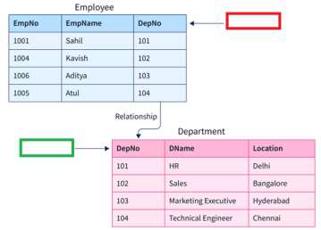
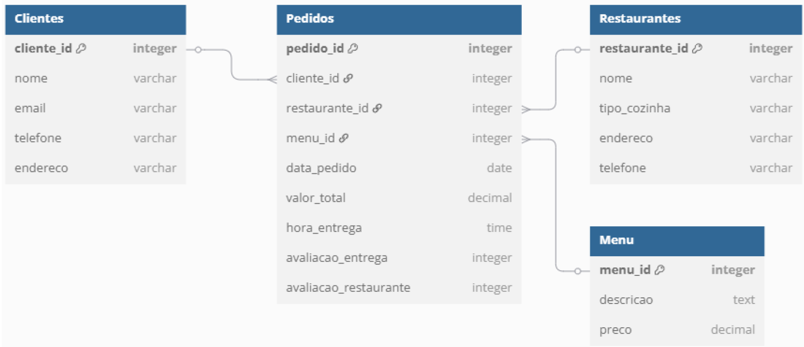

# Teste de Avaliação


# Parte I

## Questão 1. 
Qual das seguintes consultas apresenta erro de sintaxe?

```sql
(A) SELECT * FROM EMPREGADOS WHERE MORADA = NULL ORDER BY NOME
(B) SELECT * FROM EMPREGADOS ORDER BY NOME  
(C) SELECT * FROM EMPREGADOS WHERE MORADA = Madrid ORDER BY NOME  
(D) SELECT * FROM EMPREGADOS WHERE MORADA = 'Madrid' ORDER BY NOME
```

### Resposta: **(C)**

Na opção (A), não se pode utilizar a igualdade (`=`) com `NULL`. É preciso usar `IS NULL`. Contudo, não devolve erro de sintaxe.

Na opção (C), o texto `Madrid`não está entre aspas. Ou seja, `Madrid` não será reconhecido como comando SQL válido. 

## Questão 2.
Identificar nos quadrados assinalados a vermelho e a verde os conceitos que estão a ser utilizados, respetivamente:



```
(A) Chave estrangeira e chave primária
(B) Chave primária e chave estrangeira
(C) Campo obrigatório e chave estrangeira
(D) Nenhuma das respostas anteriores
``` 

### Resposta: **(A)**

## Questão 3.
Qual das seguintes instruções apresenta uma sintaxe correta para a cláusula `WHERE`?

```
(A) WHERE idade=18 AND altura > 76, peso > 72  
(B) WHERE idade=18 AND peso AND altura > 76  
(C) WHERE idade=18 AND peso > 76 AND altura > 76  
(D) WHERE idade=18 AND peso, altura > 76
```

### Resposta: **(C)**

## Questão 4.

Considere a tabela abaixo, designada por `student` (num base de dados relacional), em que a chave primária é a coluna `rollNum`.

|roolNum|name|gender|amrks|
|-------|----|------|-----|
|1|Naman|M|62|
|2|Aliya|F|70|
|3|Aliya|F|80|
|4|James|M|82|
|5|Swati|F|65|


Após a execução da consulta SQL abaixo:
```sql
SELECT *
FROM student
WHERE gender <> 'M'
  AND marks   > 65
  AND name IS NOT NULL
```

Qual o número de registos retornados pela consulta:
```
(A) 2
(B) 0
(C) 1
(D) Nenhuma das respostas anteriores
```

### Resposta: **C**

## Questão 5. 
Qual das instruções abaixo permite alterar o campo `Name` para `Interviewbit` sempre que apresentar o valor `Scaler`?

```
(A) UPDATE users SET name='Interviewbit', name='Scaler'
(B) UPDATE users SET name='Interviewbit' WHERE name='Scaler'
(C) UPDATE users SET name='Interviewbit' name='Scaler'
(D) UPDATE users SET name='Interviewbit' WHERE name <> 'Scaler'
(E) Nenhuma das respostas anteriores
```

### Resposta: **B**

## Questão 6.
Qual das consultas abaixo permite obter a quantidade total de produtos em `stock` (`ItemsInStock`)?

**products**
| ProductID | ProductName               | Cost | Price | ItemsInStock |
|-----------|---------------------------|------|--------|--------------|
| E1        | Electro Smart TV          | 800  | 1200   | 50           |
| E2        | EcoWash Washing Machine   | 400  | 600    | 30           |
| E3        | Fresco Refrigerator       | 700  | 1000   | 20           |
| E4        | Electro Microwave Oven    | 100  | 200    | 100          |
| E5        | Comfort Air Conditioner   | 1000 | 1500   | 15           |

```
(A) SELECT COUNT(ItemsInStock) FROM products
(B) SELECT SUM(ItemsInStock) FROM products
(C) SELECT SUM(ItemsInStock) FROM products GROUP BY ProductID
(D) SELECT COUNT(ItemsInStock) FROM products GROUP BY ProductID
(E) Nenhuma das respostas anteriores
```

### Resposta: **B**

## Questão 7. 
Qual das consultas abaixo permite ordenar os dados pelo nome de estudante,
excluindo os registos que não têm este campo preenchido e apresentando as primeiras
letras do alfabeto no topo dos dados retornados?

```~
(A) SELECT * FROM students WHERE NAME IS NOT NULL ORDER BY name
(B) SELECT * FROM students ORDER BY name DESC
(C) SELECT * FROM students WHERE nome IS NOT NULL ORDER BY ASC name
(D) SELECT * FROM students WHERE NAME <> NULL ORDER BY name ASC
(E) Nenhuma das respostas anteriores
```

### Resposta: **A**

## Questão 8.
Qual das consultas abaixo permite obter o `amount total` de vendas por
`vendedor` (`salesperson_id`) apenas para o `status` "shipped"?

**orders**
| order_number | order_date  | salesperson_id | product_id | amount | status   |
|--------------|-------------|----------------|------------|--------|----------|
| 1            | 2024-09-01  | 101            | P001       | 3715   | shipped  |
| 2            | 2024-09-02  | 102            | P001       | 1430   | shipped  |
| 3            | 2024-09-03  | 103            | P003       | 2017   | pending  |
| 4            | 2024-09-04  | 104            | P002       | 4264   | shipped  |
| 5            | 2024-10-05  | 102            | P003       | 5035   | pending  |
| 6            | 2024-10-06  | 103            | P002       | 1056   | pending  |
| 7            | 2024-10-07  | 104            | P002       | 528    | shipped  |
| 8            | 2024-10-08  | 104            | P001       | 2145   | pending  |
| 9            | 2024-10-09  | 103            | P002       | 750    | pending  |
| 10           | 2024-10-10  | 104            | P002       | 5792   | pending  |

<table>
<tr>
<td>
(A)<br>
<code>
SELECT salesperson_id, SUM(amount)<br>
FROM orders<br>
GROUP BY salesperson_id<br>
HAVING staus='shipped'<br>
</code>
<td>
(B)<br>
<code>
SELECT salesperson_id, SUM(amount)<br>
FROM orders<br>
GROUP BY salesperson_id<br>
</code>
<tr>
<td>
(C)<br>
<code>
SELECT salesperson_id, SUM(amount)<br>
FROM orders<br>
WHERE staus='shipped'<br>
GROUP BY amount<br>
HAVING staus='shipped'<br>
</code>
<td>
(D)<br>
<code>
SELECT salesperson_id, SUM(amount) AS<br>
total_sales<br>
FROM orders<br>
WHERE staus='shipped'<br>
GROUP BY salesperson_id;<br>
</code>
</table>


### Resposta. **D**

## Questão 9.
Qual das consultas abaixo apresenta o número de cliente cujas compras totalizam
um amount superior a 500?

**orders**
| OrderID | ClientID | ProductID | Quantity | Amount | Date       |
|---------|----------|-----------|----------|--------|------------|
| 1       | C1       | E1        | 2        | 2400   | 2023-10-01 |
| 2       | C2       | E2        | 1        | 600    | 2023-10-05 |
| 3       | C3       | E3        | 3        | 3000   | 2023-10-03 |
| 4       | C4       | E4        | 4        | 800    | 2023-10-07 |
| 5       | C3       | E3        | 2        | 2000   | 2023-10-08 |


<table>
<tr>
<td>
(A)<br>
<code>
SELECT ClienteID<br>
FROM orders<br>
WHERE amount > 500<br>
GROUP BY ClienteID<br>
HAVING SUM(amount) > 500<br>
</code>
<td>
(B)<br>
<code>
SELECT ClienteID<br>
FROM orders<br>
GROUP BY ClienteID<br>
HAVING COUNT(*) > 500<br>
</code>
<tr>
<td>
(C)<br>
<code>
SELECT ClienteID<br>
FROM orders<br>
GROUP BY ClienteID<br>
HAVING SUM(amount) > 500<br>
</code>
<td>
(D)<br>
<code>
SELECT ClienteID,<br>
FROM orders<br>
WHERE ClienteID IN (<br>
&nbsp;&nbsp;&nbsp;&nbsp;SELECT ClienteID<br>
&nbsp;&nbsp;&nbsp;&nbsp;&nbsp;&nbsp;&nbsp;&nbsp;FROM orders<br>
&nbsp;&nbsp;&nbsp;&nbsp;&nbsp;&nbsp;&nbsp;&nbsp;WHERE amount > 500<br>
)<br>
</code>
</table>


### Resposta: **C**

## Questão 10.
Qual das seguintes consultas retorna os dois maiores salários distintos da tabela funcionarios?

```
(A) SELECT DISTINCT salario FROM funcionarios LIMIT 2
(B) SELECT salario FROM funcionarios ORDER BY salario DESC LIMIT 2
(C) SELECT salario FROM funcionarios GROUP BY salario LIMIT 2
(D) SELECT MAX(2), DISTINCT salario FROM funcionarios
(E) Nenhuma das respostas anteriores
```

### Resposta: **E**

A query certa seria:
```sql
SELECT DISTINCT salario          -- "...salários distintos..."
    FROM funcionarios
    ORDER BY salario DESC        -- orden descendente para que os maiores fiquem primeiro
    LIMIT 2;                     -- lista apenas 2 (maiores)
```

---

# Parte II

Passo 0: preparação do sistema para correr em Jupyter Notebook


```python
%pip install jupysql --upgrade --quiet

# Load the jupysql extension
# This allows us to use SQL magic commands in Jupyter notebooks
%load_ext sql

# Connect to the SQLite database
%sql sqlite:///teste_de_avaliacao_01.sqlite

# Set the display limit for SQL queries
# This controls how many rows are displayed in the output of SQL queries
%config SqlMagic.displaylimit = 0

# Enable foreign key constraints in SQLite
# This ensures that foreign key relationships are enforced in the database
%sql PRAGMA foreign_keys = ON

# Display the list of tables in the database
# This command lists all the tables in the connected SQLite database
%sqlcmd tables
```

    Note: you may need to restart the kernel to use updated packages.
    


<span style="None">Connecting to &#x27;sqlite:///teste_de_avaliacao_01.sqlite&#x27;</span>


<span style="None">Running query in &#x27;sqlite:///teste_de_avaliacao_01.sqlite&#x27;</span>


<table>
    <thead>
        <tr>
            <th>Name</th>
        </tr>
    </thead>
    <tbody>
        <tr>
            <td>clientes</td>
        </tr>
        <tr>
            <td>menu</td>
        </tr>
        <tr>
            <td>pedidos</td>
        </tr>
        <tr>
            <td>restaurantes</td>
        </tr>
    </tbody>
</table>


## Questão 1.
Para o modelo de dados abaixo, implementar as consultas solicitadas:



```sql
%%sql
-- Eliminar todas as tabelas se já existirem
DROP TABLE IF EXISTS pedidos;
DROP TABLE IF EXISTS menu;
DROP TABLE IF EXISTS restaurantes;
DROP TABLE IF EXISTS clientes;
```


<span style="None">Running query in &#x27;sqlite:///teste_de_avaliacao_01.sqlite&#x27;</span>


<table>
    <thead>
        <tr>
        </tr>
    </thead>
    <tbody>
    </tbody>
</table>


### Tabela clientes


```sql
%%sql
-- Tabela: Clientes
DROP TABLE IF EXISTS clientes;

CREATE TABLE IF NOT EXISTS clientes (
    cliente_id INTEGER PRIMARY KEY AUTOINCREMENT,  -- PK, auto-incremento
    nome       VARCHAR NOT NULL,                   -- nome do cliente
    email      VARCHAR,                            -- e-mail
    telefone   VARCHAR,                            -- contacto telefónico
    endereco   VARCHAR                             -- morada
);
```


<span style="None">Running query in &#x27;sqlite:///teste_de_avaliacao_01.sqlite&#x27;</span>


<table>
    <thead>
        <tr>
        </tr>
    </thead>
    <tbody>
    </tbody>
</table>


```sql
%%sql
INSERT INTO clientes (nome, email, telefone, endereco) VALUES
    ('Joana Silva',        'joana.silva@email.com',      '912345678', 'Rua das Flores 12, Lisboa'),
    ('Miguel Ferreira',    'miguel.ferreira@email.com',  '913456789', 'Av. República 45, Porto'),
    ('Rita Costa',         'rita.costa@email.com',       '914567890', 'Praça do Comércio 3, Lisboa'),
    ('Tiago Santos',       'tiago.santos@email.com',     '915678901', 'Rua Direita 100, Braga'),
    ('Carla Marques',      'carla.marques@email.com',    '916789012', 'Estrada da Luz 34, Coimbra'),
    ('André Oliveira',     'andre.oliveira@email.com',   '917890123', 'Rua Central 18, Faro'),
    ('Beatriz Almeida',    'beatriz.almeida@email.com',  '918901234', 'Rua do Sol 77, Aveiro'),
    ('Pedro Rocha',        'pedro.rocha@email.com',      '919012345', 'Rua Nova 25, Guimarães'),
    ('Inês Matos',         'ines.matos@email.com',       '911234567', 'Rua da Escola 5, Setúbal'),
    ('Hugo Martins',       'hugo.martins@email.com',     '910123456', 'Av. dos Aliados 1, Porto');
```


<span style="None">Running query in &#x27;sqlite:///teste_de_avaliacao_01.sqlite&#x27;</span>


<span style="color: green">10 rows affected.</span>


<table>
    <thead>
        <tr>
        </tr>
    </thead>
    <tbody>
    </tbody>
</table>


Clientes extra sem pedidos 


```sql
%%sql
INSERT INTO clientes (nome, email, telefone, endereco) VALUES
    -- Clientes fictícios que não têm pedidos
    ('Zeus Olimpo',     'zeus@olimpo.gr',     '921111111', 'Monte Olimpo, Grécia'),
    ('Atenas Parthenos','athena@parthenon.gr','922222222', 'Acrópole, Atenas, Grécia'),
    ('Poseidon Maris',  'poseidon@oceanos.gr','933333333', 'Cabo Sunião, Grécia');

```


<span style="None">Running query in &#x27;sqlite:///teste_de_avaliacao_01.sqlite&#x27;</span>


<span style="color: green">3 rows affected.</span>


<table>
    <thead>
        <tr>
        </tr>
    </thead>
    <tbody>
    </tbody>
</table>


### Tabela: Restaurantes 


```sql
%%sql
-- Tabela: Restaurantes
DROP TABLE IF EXISTS restaurantes;

CREATE TABLE IF NOT EXISTS restaurantes (
    restaurante_id INTEGER PRIMARY KEY AUTOINCREMENT,  -- PK
    nome           VARCHAR NOT NULL,                   -- nome do restaurante
    tipo_cozinha   VARCHAR,                            -- ex: Asian, Italian…
    endereco       VARCHAR,                            -- morada
    telefone       VARCHAR                             -- contacto
);
```


<span style="None">Running query in &#x27;sqlite:///teste_de_avaliacao_01.sqlite&#x27;</span>


<table>
    <thead>
        <tr>
        </tr>
    </thead>
    <tbody>
    </tbody>
</table>


```sql
%%sql
INSERT INTO restaurantes (nome, tipo_cozinha, endereco, telefone) VALUES
    ('Bairaktaris Central', 'Greek',       'Monastiraki Square, Athens 10555, Greece',           '+30 21 0321 3036'),
    ('O Thanasis',          'Greek',       'Mitropoleos 69, Athens 10555, Greece',               '+30 21 0324 4705'),
    ('Nolan',               'Asian',       'Voulis 31-33, Athens 10557, Greece',                 '+30 21 0324 3545'),
    ('Trattoria Italia',    'Italian',     'Skoufou 29, Athens 10557, Greece',                   '+30 21 0323 5050'),
    ('Spondi',              'French',      'Pirronos 5, Athens 11636, Greece',                   '+30 21 0756 4021'),
    ('Varoulko Seaside',    'Seafood',     'Akti Koumoundourou 54, Piraeus 18533, Greece',       '+30 21 0522 8400'),
    ('Hytra',               'Modern Greek','Leof. Andrea Syngrou 107-109, Athens 11745, Greece', '+30 21 0331 6767'),
    ('CTC Urban Gastronomy','Modern',      'Plateon 15, Athens 10435, Greece',                   '+30 21 0822 4760'),
    ('Lefteris o Politis',  'Greek',       'Satovriandou 20, Omonia, Athens 10432, Greece',      '+30 21 0522 5676'),
    ('Falafellas', 'Middle Eastern',       'Aiolou 51, Athens 10551, Greece',                    '+30 21 0323 9809');
```


<span style="None">Running query in &#x27;sqlite:///teste_de_avaliacao_01.sqlite&#x27;</span>


<span style="color: green">10 rows affected.</span>


<table>
    <thead>
        <tr>
        </tr>
    </thead>
    <tbody>
    </tbody>
</table>


### Tabela: Menu


```sql
%%sql
-- Tabela: Menu
DROP TABLE IF EXISTS menu;

CREATE TABLE IF NOT EXISTS menu (
    menu_id    INTEGER PRIMARY KEY AUTOINCREMENT,  -- PK
    descricao  TEXT NOT NULL,                      -- descrição do prato/menu
    preco      DECIMAL                             -- preço (SQLite: armazena como NUMERIC/REAL)
);
```


<span style="None">Running query in &#x27;sqlite:///teste_de_avaliacao_01.sqlite&#x27;</span>


<table>
    <thead>
        <tr>
        </tr>
    </thead>
    <tbody>
    </tbody>
</table>


```sql
%%sql
INSERT INTO menu (descricao, preco) VALUES
    -- Pratos Gregos tradicionais
    ('Souvlaki de porco no pão pita',                   6.00),
    ('Gyros de frango com batatas fritas',              6.50),
    ('Kebab picado com especiarias',                    7.00),
    ('Moussaka grega tradicional',                      8.00),
    ('Salada grega com queijo feta e azeitonas',        5.00),

    -- Cozinha do Médio Oriente (Falafellas)
    ('Falafel no pão pita com molho tahini',            5.50),
    ('Prato vegetariano com húmus e tabbouleh',         6.50),

    -- Cozinha asiática (Nolan)
    ('Ramen com barriga de porco e ovo marinado',      11.00),
    ('Tataki de atum com arroz de jasmim',             13.50),

    -- Cozinha italiana (Trattoria Italia)
    ('Spaghetti alla Carbonara',                        9.50),
    ('Penne all’Arrabbiata',                            8.50),
    ('Pizza Margherita com manjericão fresco',          7.00),

    -- Cozinha francesa (Spondi)
    ('Magret de pato com redução de vinho tinto',      17.00),
    ('Foie gras com figo caramelizado',                19.50),

    -- Cozinha de mar (Varoulko Seaside)
    ('Polvo grelhado com azeite e orégãos',            15.00),
    ('Risoto de camarão com tinta de choco',           14.50),

    -- Modern Greek (Hytra, CTC)
    ('Cordeiro confitado com puré de fava',            16.00),
    ('Salada de beterraba com queijo manouri',         9.00),
    ('Degustação de peixe branco com creme cítrico',   18.00),

    -- Sobremesa
    ('Baklava com mel e nozes',                         4.00);

```


<span style="None">Running query in &#x27;sqlite:///teste_de_avaliacao_01.sqlite&#x27;</span>


<span style="color: green">20 rows affected.</span>


<table>
    <thead>
        <tr>
        </tr>
    </thead>
    <tbody>
    </tbody>
</table>


### Tabela: `Pedidos`


```sql
%%sql
-- Tabela: Pedidos
DROP TABLE IF EXISTS pedidos;

CREATE TABLE IF NOT EXISTS pedidos (
    pedido_id            INTEGER PRIMARY KEY AUTOINCREMENT,        -- PK
    cliente_id           INTEGER NOT NULL,                         -- FK → clientes
    restaurante_id       INTEGER NOT NULL,                         -- FK → restaurantes
    menu_id              INTEGER NOT NULL,                         -- FK → menu
    data_pedido          DATE NOT NULL,                            -- data do pedido
    valor_total          DECIMAL,                                  -- total em €
    hora_entrega         TIME,                                     -- hora prevista/real de entrega
    avaliacao_entrega    INTEGER,                                  -- rating da entrega
    avaliacao_restaurante INTEGER,                                 -- rating do restaurante

    -- Chaves estrangeiras:
    FOREIGN KEY (cliente_id)     REFERENCES clientes(cliente_id),
    FOREIGN KEY (restaurante_id) REFERENCES restaurantes(restaurante_id),
    FOREIGN KEY (menu_id)        REFERENCES menu(menu_id)
);
```


<span style="None">Running query in &#x27;sqlite:///teste_de_avaliacao_01.sqlite&#x27;</span>


<table>
    <thead>
        <tr>
        </tr>
    </thead>
    <tbody>
    </tbody>
</table>


gerado pelo ChatGPT:
1. Equilíbrio de dados:
    * Cada cliente_id aparece 4 × (40 pedidos ÷ 10 clientes).
    * Cada restaurante_id e menu_id surgem várias vezes, garantindo diversidade.
2. Coerência de datas
    * Intervalo de 2025-06-30 a 2025-07-09 para simular um período de 10 dias de atividade.
3. Avaliações (1-5)
    * Distribuídas realisticamente (mais 4-5 do que 1-2).
4. Integridade referencial
    * IDs correspondem aos valores de clientes, restaurantes e menu já inseridos.


```sql
%%sql
INSERT INTO pedidos
      (cliente_id, restaurante_id, menu_id, data_pedido,
       valor_total, hora_entrega, avaliacao_entrega, avaliacao_restaurante)
VALUES
      -- 2025-06-30
      (1, 1, 1,  '2025-06-30',  6.00, '12:45', 5, 4),
      (2, 2, 3,  '2025-06-30',  7.00, '13:10', 4, 5),
      (3, 3, 8,  '2025-06-30', 11.00, '19:30', 5, 5),
      (4, 4, 10, '2025-06-30',  9.50, '20:05', 3, 4),

      -- 2025-07-01
      (5, 5, 13, '2025-07-01', 17.00, '21:00', 4, 5),
      (6, 6, 15, '2025-07-01', 15.00, '13:20', 4, 4),
      (7, 7, 17, '2025-07-01', 16.00, '20:40', 5, 5),
      (8, 8, 19, '2025-07-01', 18.00, '21:10', 4, 5),

      -- 2025-07-02
      (9, 9, 17, '2025-07-02', 16.00, '12:50', 5, 4),
      (10,10,19,'2025-07-02', 18.00, '13:15', 4, 4),
      (1, 2, 4,  '2025-07-02',  8.00, '19:05', 3, 4),
      (2, 1, 2,  '2025-07-02',  6.50, '19:30', 4, 5),

      -- 2025-07-03
      (3, 3, 9,  '2025-07-03', 13.50, '20:20', 4, 5),
      (4, 4, 11, '2025-07-03',  8.50, '21:00', 5, 4),
      (5, 5, 14, '2025-07-03', 19.50, '13:00', 5, 5),
      (6, 6, 16, '2025-07-03', 14.50, '13:40', 4, 4),

      -- 2025-07-04
      (7, 7, 18, '2025-07-04',  9.00, '12:35', 5, 4),
      (8, 8, 20, '2025-07-04',  4.00, '19:10', 4, 5),
      (9, 9, 1,  '2025-07-04',  6.00, '19:45', 5, 4),
      (10,10,6, '2025-07-04',  5.50, '20:00', 3, 4),

      -- 2025-07-05
      (1, 3, 8,  '2025-07-05', 11.00, '13:25', 5, 5),
      (2, 4, 12, '2025-07-05',  7.00, '13:55', 4, 4),
      (3, 5, 14, '2025-07-05', 19.50, '20:15', 5, 5),
      (4, 6, 15, '2025-07-05', 15.00, '20:40', 4, 5),

      -- 2025-07-06
      (5, 7, 17, '2025-07-06', 16.00, '12:30', 5, 5),
      (6, 8, 19, '2025-07-06', 18.00, '12:55', 4, 4),
      (7, 9, 3,  '2025-07-06',  7.00, '19:10', 5, 4),
      (8,10, 6,  '2025-07-06',  5.50, '19:35', 3, 4),

      -- 2025-07-07
      (9, 1, 2,  '2025-07-07',  6.50, '20:05', 4, 5),
      (10,2, 4,  '2025-07-07',  8.00, '20:20', 4, 4),
      (1, 5, 13, '2025-07-07', 17.00, '13:10', 5, 5),
      (2, 6, 16, '2025-07-07', 14.50, '13:40', 4, 4),

      -- 2025-07-08
      (3, 7, 18, '2025-07-08',  9.00, '12:45', 5, 4),
      (4, 8, 20, '2025-07-08',  4.00, '19:00', 4, 5),
      (5, 9, 17, '2025-07-08', 16.00, '19:25', 5, 5),
      (6,10, 6,  '2025-07-08',  5.50, '19:50', 4, 4),

      -- 2025-07-09
      (7, 3, 9,  '2025-07-09', 13.50, '20:10', 5, 5),
      (8, 4, 11, '2025-07-09',  8.50, '20:30', 4, 4),
      (9, 5, 14, '2025-07-09', 19.50, '13:05', 5, 5),
      (10,6, 15, '2025-07-09', 15.00, '13:30', 4, 4);

```


<span style="None">Running query in &#x27;sqlite:///teste_de_avaliacao_01.sqlite&#x27;</span>


<span style="color: green">40 rows affected.</span>


<table>
    <thead>
        <tr>
        </tr>
    </thead>
    <tbody>
    </tbody>
</table>


### Questão 1 (a).
Listar o nome dos clientes que nunca fizeram um pedido (ordenar os registos com as primeiras letras do alfabeto no início dos dados retornados).


```sql
%%sql
SELECT nome
FROM clientes
WHERE cliente_id NOT IN (
    SELECT cliente_id FROM pedidos
)
ORDER BY nome ASC;

```


<span style="None">Running query in &#x27;sqlite:///teste_de_avaliacao_01.sqlite&#x27;</span>


<table>
    <thead>
        <tr>
            <th>nome</th>
        </tr>
    </thead>
    <tbody>
        <tr>
            <td>Atenas Parthenos</td>
        </tr>
        <tr>
            <td>Poseidon Maris</td>
        </tr>
        <tr>
            <td>Zeus Olimpo</td>
        </tr>
    </tbody>
</table>


### Questão 1 (b)
Apresentar os descritivos do menús em que o restaurante do pedido não tem o
campo tipo_cozinha definido ou o tipo de cozinha não é Asian.


```sql
%%sql
SELECT m.descricao  AS "Descrição do Menu não Asian"
FROM pedidos p
JOIN restaurantes r ON p.restaurante_id = r.restaurante_id
JOIN menu m         ON p.menu_id = m.menu_id
WHERE r.tipo_cozinha IS NULL
   OR LOWER(r.tipo_cozinha) != 'asian';

```


<span style="None">Running query in &#x27;sqlite:///teste_de_avaliacao_01.sqlite&#x27;</span>


<table>
    <thead>
        <tr>
            <th>Descrição do Menu não Asian</th>
        </tr>
    </thead>
    <tbody>
        <tr>
            <td>Souvlaki de porco no pão pita</td>
        </tr>
        <tr>
            <td>Kebab picado com especiarias</td>
        </tr>
        <tr>
            <td>Spaghetti alla Carbonara</td>
        </tr>
        <tr>
            <td>Magret de pato com redução de vinho tinto</td>
        </tr>
        <tr>
            <td>Polvo grelhado com azeite e orégãos</td>
        </tr>
        <tr>
            <td>Cordeiro confitado com puré de fava</td>
        </tr>
        <tr>
            <td>Degustação de peixe branco com creme cítrico</td>
        </tr>
        <tr>
            <td>Cordeiro confitado com puré de fava</td>
        </tr>
        <tr>
            <td>Degustação de peixe branco com creme cítrico</td>
        </tr>
        <tr>
            <td>Moussaka grega tradicional</td>
        </tr>
        <tr>
            <td>Gyros de frango com batatas fritas</td>
        </tr>
        <tr>
            <td>Penne all’Arrabbiata</td>
        </tr>
        <tr>
            <td>Foie gras com figo caramelizado</td>
        </tr>
        <tr>
            <td>Risoto de camarão com tinta de choco</td>
        </tr>
        <tr>
            <td>Salada de beterraba com queijo manouri</td>
        </tr>
        <tr>
            <td>Baklava com mel e nozes</td>
        </tr>
        <tr>
            <td>Souvlaki de porco no pão pita</td>
        </tr>
        <tr>
            <td>Falafel no pão pita com molho tahini</td>
        </tr>
        <tr>
            <td>Pizza Margherita com manjericão fresco</td>
        </tr>
        <tr>
            <td>Foie gras com figo caramelizado</td>
        </tr>
        <tr>
            <td>Polvo grelhado com azeite e orégãos</td>
        </tr>
        <tr>
            <td>Cordeiro confitado com puré de fava</td>
        </tr>
        <tr>
            <td>Degustação de peixe branco com creme cítrico</td>
        </tr>
        <tr>
            <td>Kebab picado com especiarias</td>
        </tr>
        <tr>
            <td>Falafel no pão pita com molho tahini</td>
        </tr>
        <tr>
            <td>Gyros de frango com batatas fritas</td>
        </tr>
        <tr>
            <td>Moussaka grega tradicional</td>
        </tr>
        <tr>
            <td>Magret de pato com redução de vinho tinto</td>
        </tr>
        <tr>
            <td>Risoto de camarão com tinta de choco</td>
        </tr>
        <tr>
            <td>Salada de beterraba com queijo manouri</td>
        </tr>
        <tr>
            <td>Baklava com mel e nozes</td>
        </tr>
        <tr>
            <td>Cordeiro confitado com puré de fava</td>
        </tr>
        <tr>
            <td>Falafel no pão pita com molho tahini</td>
        </tr>
        <tr>
            <td>Penne all’Arrabbiata</td>
        </tr>
        <tr>
            <td>Foie gras com figo caramelizado</td>
        </tr>
        <tr>
            <td>Polvo grelhado com azeite e orégãos</td>
        </tr>
    </tbody>
</table>


## Questão 1(b)
Qual o valor médio dos pedidos de cada cliente?


```sql
%%sql
SELECT 
    c.nome,
    ROUND(AVG(p.valor_total), 2) AS media_pedidos
FROM clientes c
JOIN pedidos p ON c.cliente_id = p.cliente_id
GROUP BY c.cliente_id, c.nome
ORDER BY c.nome;
```


<span style="None">Running query in &#x27;sqlite:///teste_de_avaliacao_01.sqlite&#x27;</span>


<table>
    <thead>
        <tr>
            <th>nome</th>
            <th>media_pedidos</th>
        </tr>
    </thead>
    <tbody>
        <tr>
            <td>André Oliveira</td>
            <td>13.25</td>
        </tr>
        <tr>
            <td>Beatriz Almeida</td>
            <td>11.38</td>
        </tr>
        <tr>
            <td>Carla Marques</td>
            <td>17.13</td>
        </tr>
        <tr>
            <td>Hugo Martins</td>
            <td>11.63</td>
        </tr>
        <tr>
            <td>Inês Matos</td>
            <td>12.0</td>
        </tr>
        <tr>
            <td>Joana Silva</td>
            <td>10.5</td>
        </tr>
        <tr>
            <td>Miguel Ferreira</td>
            <td>8.75</td>
        </tr>
        <tr>
            <td>Pedro Rocha</td>
            <td>9.0</td>
        </tr>
        <tr>
            <td>Rita Costa</td>
            <td>13.25</td>
        </tr>
        <tr>
            <td>Tiago Santos</td>
            <td>9.25</td>
        </tr>
    </tbody>
</table>


## Questão 1 (d)
Listar o total de receitas gerada por cada restaurante, mas só os restaurantes que
faturaram mais de `1000€` e com mais de `20` pedidos?


```sql
%%sql
SELECT
    r.nome AS restaurante,
    SUM(p.valor_total) AS total_receita,
    COUNT(*) AS total_pedidos
FROM restaurantes r
JOIN pedidos p ON p.restaurante_id = r.restaurante_id
GROUP BY r.restaurante_id, r.nome
HAVING SUM(p.valor_total) > 1000  -- faturação superior a 1000 €
   AND COUNT(*) > 20              -- mais de 20 pedidos
ORDER BY total_receita DESC;
```


<span style="None">Running query in &#x27;sqlite:///teste_de_avaliacao_01.sqlite&#x27;</span>


<table>
    <thead>
        <tr>
            <th>restaurante</th>
            <th>total_receita</th>
            <th>total_pedidos</th>
        </tr>
    </thead>
    <tbody>
    </tbody>
</table>


Como os valores sugeridos no enunciado são muito elevados, repete-se a query para valores mais pequenos

Listar o total de receitas gerada por cada restaurante, mas só os restaurantes que
faturaram mais de `40€` e com mais de `2` pedidos?


```sql
%%sql
SELECT
    r.nome AS restaurante,
    SUM(p.valor_total) AS total_receita,
    COUNT(*) AS total_pedidos
FROM restaurantes r
JOIN pedidos p ON p.restaurante_id = r.restaurante_id
GROUP BY r.restaurante_id, r.nome
HAVING SUM(p.valor_total) > 40   -- faturação superior a 40 €
   AND COUNT(*) > 2              -- mais de 2 pedidos
ORDER BY total_receita DESC;
```


<span style="None">Running query in &#x27;sqlite:///teste_de_avaliacao_01.sqlite&#x27;</span>


<table>
    <thead>
        <tr>
            <th>restaurante</th>
            <th>total_receita</th>
            <th>total_pedidos</th>
        </tr>
    </thead>
    <tbody>
        <tr>
            <td>Spondi</td>
            <td>92.5</td>
            <td>5</td>
        </tr>
        <tr>
            <td>Varoulko Seaside</td>
            <td>74.0</td>
            <td>5</td>
        </tr>
        <tr>
            <td>Hytra</td>
            <td>50</td>
            <td>4</td>
        </tr>
        <tr>
            <td>Nolan</td>
            <td>49.0</td>
            <td>4</td>
        </tr>
        <tr>
            <td>Lefteris o Politis</td>
            <td>45</td>
            <td>4</td>
        </tr>
        <tr>
            <td>CTC Urban Gastronomy</td>
            <td>44</td>
            <td>4</td>
        </tr>
    </tbody>
</table>


## Questão 1 (e)
Determinar a quantidade de clientes que fizeram pedidos e não atribuíram uma
avaliação ao restaurante ou a nota da entrega é inferior a 5


```sql
%%sql
SELECT COUNT(DISTINCT p.cliente_id) AS clientes_afetados
FROM pedidos p
WHERE p.avaliacao_restaurante IS NULL
   OR p.avaliacao_entrega < 5;
```


<span style="None">Running query in &#x27;sqlite:///teste_de_avaliacao_01.sqlite&#x27;</span>


<table>
    <thead>
        <tr>
            <th>clientes_afetados</th>
        </tr>
    </thead>
    <tbody>
        <tr>
            <td>9</td>
        </tr>
    </tbody>
</table>


---
end of file
